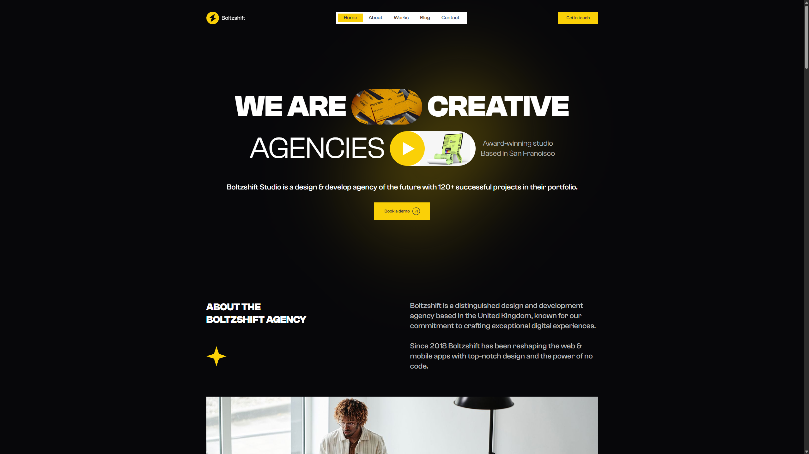
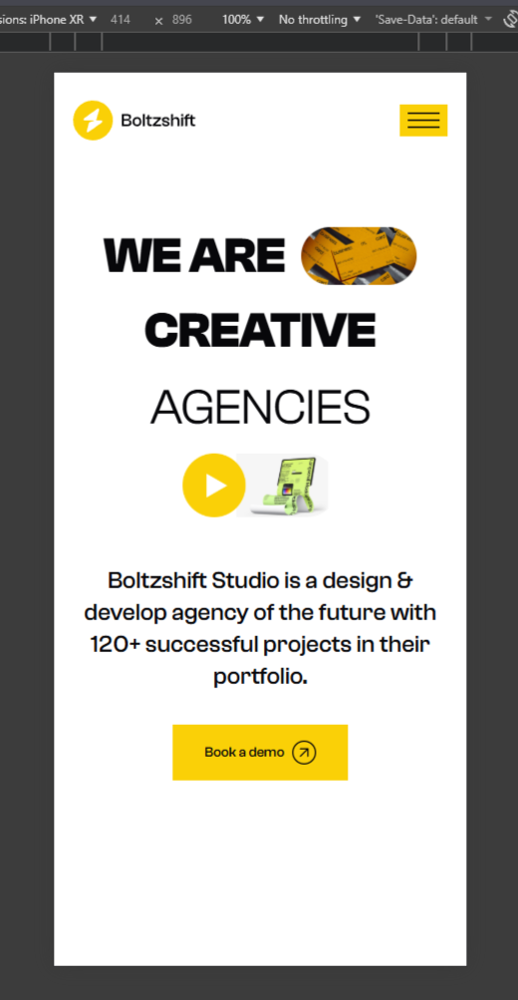
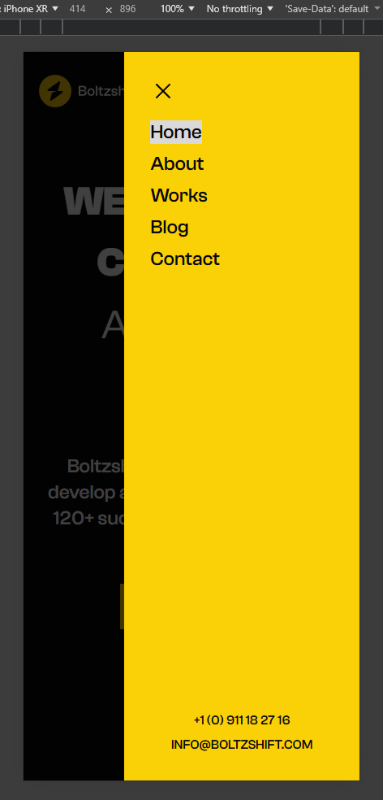
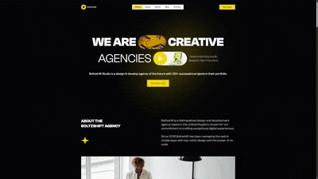

# Проект для портфолио (Bultzshift Studio)

Многостраничный сайт агенства, реализованный на ниже приложенном макете из Figma.
Разработана только главная страница, т.к в макете кроме неё больше не предусмотрено.

## Макет / Design

https://www.figma.com/design/oDRC9eIfbSdlnwpJ4QBICW/Free-Agency-Sass-Landing-Page-Template--Community-?node-id=0-1&p=f&t=bsCCl50IMcVP2YQ6-0

## Стек / Stack

### Основа / Core
- React
- TypeScript
- SCSS
- Framer Motion

### Библиотеки / Libraries
- clsx
- focus-trap-react
- react-hook-form
- react-router-dom

## Установка / Installation

```bash
git clone <ссылка / url>
cd launch/client
npm install
npm run dev
```

## Фишки / Features

- Полностью адаптивный интерфейс
- Плавные анимации появления (Framer Motion)
- Бургер-меню (focus trap & блокировка скролла)
- Формы с валидацией (RHF)
- Бегущая строка
- Интеграция интерактивной карты Google Maps для отображения локации компании
- Поддержка навигации с клавиатуры (для a11y)
- Автоматическая светлая/темная тема
- Модульная архитектура
- Переиспользуемая UI система

## Структура

```text
src/
  components/
    sections/ # секции страниц
    svgs/ # линейные иконки(.tsx)
    UI/ # переиспользуемое

  entities/
    data/ # данные
    types/ # типы

  features/
    /Reveal # анимации
    /Scroll # секционная навигация
    /...
  pages/ # страницы
  styles/
    base/ # сброс, настройки
    functions/ # SCSS функции
    mixins/ # миксины
    tokens/ # переменные
```

## Превью / Preview

### Desktop Dark Theme


### Mobile White Theme


### Burger-menu


### Animation


## Версии / Environment

Проект разработан в окружении:

### Core
- Node.js: 24.13.1
- npm: 11.8.0

### Frontend
- React: 19.2.5
- React DOM: 19.2.5
- TypeScript: 6.0.3
- Vite: 8.0.9
- Sass: 1.99.0

### UI / Libraries
- clsx: 2.1.1
- framer-motion: 12.38.0
- react-router-dom: 7.14.2
- react-hook-form: 7.74.0
- focus-trap-react: 12.0.1

### Dev tools
- ESLint: 9.39.4
- TypeScript ESLint: 8.59.0
- @vitejs/plugin-react: 6.0.1

### Types
- @types/react: 19.2.14
- @types/react-dom: 19.2.3
- @types/node: 24.12.2